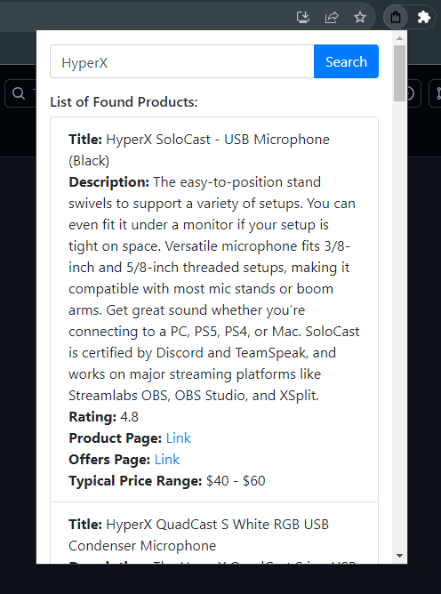

# NiftyFind Chrome Extension

NiftyFind is a Chrome extension designed to swiftly search and locate products using the RapidAPI. With a seamless user interface, users can quickly get insights about various products and their details right from their browser.

### Project Details:
- **Date:** 09/16/2023
- **Author:** Austin Lee Smith
- **Email:** [als0184@auburn.edu](mailto:als0184@auburn.edu)
- **GitHub:** [https://github.com/als0184](https://github.com/als0184)
## Features

NiftyFind fetches the following product details:
- **Title**: The product's name or title.
- **Description**: A brief summary or description of the product.
- **Rating**: User rating or reviews for the product.
- **Product Page**: Direct link to the product page for detailed information or purchase.
- **Offers Page**: Link to check out any ongoing offers or deals for the product from various retailers.
- **Typical Price Range**: A range to give users an idea of the product's cost.

## Usage

### 1. Setup Environment:
Ensure you have the latest version of the Chrome browser installed on your system.

### 2. RapidAPI Setup:
- Visit [RapidAPI's Real-Time Product Search page](https://rapidapi.com/letscrape-6bRBa3QguO5/api/real-time-product-search/) and create an account.
- Once registered, obtain your API key from the dashboard.
- In the `script.js` file of the project, replace `'YOUR_API_KEY_HERE'` with your actual API key. Ensure you do not share your key when pushing to version control or in any other public space.

### 3. Extension Installation:
- Clone the repository.
- Follow the [official Chrome instructions](https://developer.chrome.com/docs/extensions/mv3/getstarted/#manifest) to load your extension into your Chrome browser.
- Once installed, click on the NiftyFind icon in the Chrome toolbar, input a product name, and view the search results instantly!

## Additional Notes
- NiftyFind utilizes the RapidAPI to efficiently retrieve product data.
  
- The extension's UI leverages Bootstrap, aiming for a clean and user-friendly experience.
  
---

